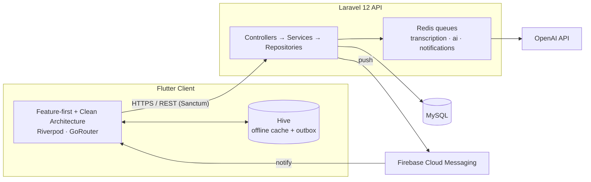

# MeetMind AI

**AI-powered meeting notes & smart task management** — record a meeting,
get an AI-generated transcript, summary, mood read, and suggested action
items automatically, then manage everything as real tasks with your team.

Flutter client · Laravel 12 API · OpenAI · Firebase Cloud Messaging


---

## What it does

Record a meeting → MeetMind transcribes it, generates an executive
summary with decisions/risks/next steps/deadlines, reads the room's
overall mood, and drafts task suggestions you review and confirm. Tasks
(AI-suggested or hand-created) get a Kanban board, comments, attachments,
and deadline reminders. Teams get shared workspaces with roles and an
activity log. An in-meeting AI assistant answers questions about the
transcript, and global search covers meetings, tasks, and people. The app
works offline — meetings and tasks are cached locally, and edits queue up
and sync automatically when you're back online.

## Screenshots

*Coming soon* — this README ships ahead of a device pass; screenshots and
a short demo video are the last thing to drop in before tagging the
public v1.0 release. (See `PHASE12_README.md`'s launch checklist.)

## Architecture



Full write-up (schema, job pipeline, security model) in `Architecture.md`.
Requirements in `srd.md`. UI/UX spec in `design.md`. Phase-by-phase build
plan in `phases.md`.

## Tech stack

| Layer | Choices |
|---|---|
| Client | Flutter 3.x, Riverpod 2.x, GoRouter, Dio, Hive |
| Server | Laravel 12, PHP 8.3+, MySQL 8, Redis |
| AI | OpenAI API (transcription, summarization, chat) |
| Push | Firebase Cloud Messaging |
| Charts | fl_chart |

## Getting started

This scaffold contains the **Dart source tree only** — the platform
folders (`android/`, `ios/`, `web/`, etc.) and `pubspec.lock` aren't
committed (see `.gitignore`). Generate them locally:

```bash
flutter create --project-name meetmind_ai --org com.meetmind --platforms android,ios .
flutter pub get
dart run build_runner build --delete-conflicting-outputs
flutter run
```

By default the app points at `http://10.0.2.2:8000/api/v1` (the Android
emulator's alias for `localhost:8000`). Override per-build:

```bash
flutter run --dart-define=API_BASE_URL=http://localhost:8000/api/v1
```

**Google Sign-In** and **microphone permission** setup steps are
unchanged from earlier phases — see `PHASE0`–`PHASE3` history in
`CHANGELOG.md` and the package READMEs linked there
(`google_sign_in_android`/`google_sign_in_ios`, and the
`RECORD_AUDIO`/`NSMicrophoneUsageDescription` platform entries).

## Running the test suite

```bash
flutter test
```

Unit tests, widget tests, and a couple of Hive-backed integration tests
(sync status, offline outbox) live under `test/`, organized to mirror
`lib/`. See `PHASE11_README.md` for what's covered.

## Architecture — feature-first + Clean Architecture

```
lib/
├── core/            # network, storage (Hive/secure), theme, router, di,
│                     sync (offline outbox), export (PDF/Markdown/RTF + share),
│                     insights (meeting score, productivity tips)
└── features/
    └── <feature>/
        ├── data/            # DTOs, datasources (Dio/Hive), repository impls
        ├── domain/          # entities, repository interfaces, use cases (pure Dart)
        └── presentation/    # screens, widgets, Riverpod providers
```

Rule of thumb per layer:
- **domain/** never imports Flutter or Dio — pure Dart only.
- **data/** implements domain's repository interfaces using `core/network`
  (remote) and `core/storage` (local/offline cache).
- **presentation/** holds `ConsumerWidget`s and `Notifier`/`AsyncNotifier`
  providers; it depends on domain use cases, never on `data/` directly.

## Feature highlights

- 🎙️ Recording with a live waveform, pause/resume, and chunked/resumable
  background upload — survives app restarts and flaky connections.
- 🤖 AI pipeline: transcript → executive summary (decisions, risks, next
  steps, deadlines, mood) → task suggestions you confirm or edit before
  they become real tasks.
- 💬 In-meeting AI assistant chat with suggested prompts (summarize,
  draft a follow-up email, generate minutes, convert to a project plan).
- ✅ Full task management: Kanban board, comments, attachments, progress,
  deadline chips, assignment.
- 👥 Workspaces with roles (owner/admin/member), departments, and an
  activity timeline.
- 🔍 Global search across meetings, tasks, and people.
- 📊 Workspace-scoped analytics (meetings/month, task completion,
  productivity score) and a platform admin panel.
- 📡 Offline-first: meetings/tasks cache locally, edits queue in an
  outbox and replay on reconnect, with a manual-merge screen for tasks
  that diverged from the server while you were offline.
- 📤 Export a meeting summary as PDF, Markdown, or Word (.rtf), or share
  it straight to another app.
- ✨ An AI Meeting Score and personalized productivity tips, computed
  entirely client-side from data already on screen.

## Phase completion

| Phase | What it delivered |
|---|---|
| 0 | Project scaffolding, Flutter ↔ Laravel `/ping` connectivity |
| 1 | Auth (email/password + Google), profile |
| 2 | Meetings CRUD, participant invites, basic notifications |
| 3 | Audio recording, chunked/resumable background upload |
| 4 | AI transcription → summary → task-suggestion pipeline |
| 5 | Full task management (Kanban, comments, attachments) |
| 6 | Push notifications, calendar |
| 7 | Workspaces, roles, departments, activity log |
| 8 | In-meeting AI assistant, global search |
| 9 | Analytics dashboard, admin panel |
| 10 | Offline support: Hive cache, outbox pattern, conflict resolution |
| 11 | Frontend test suite, security review, cross-device audit |
| 12 | UI polish, export/share, bonus AI features, launch prep (this) |

Full per-phase detail (what shipped, design decisions, known
simplifications) is in each `PHASE{N}_README.md` and summarized in
`CHANGELOG.md`.

## Known simplifications (carried across phases)

- Offline support covers meetings/tasks core CRUD + status; participant
  invites, comments, attachments, and progress/assignment stay
  online-only (Phase 10).
- "Word" export is RTF, not a hand-built `.docx` — opens natively in
  Word/Google Docs with none of the OOXML complexity (Phase 12).
- Chat history (AI assistant) and recent searches are session-only, not
  persisted server-side (Phase 8).
- No widget/unit tests existed before Phase 11 — this sandbox has never
  had the Flutter SDK to run `flutter analyze`/`flutter test`, so please
  run both after `flutter pub get` and report back what comes up.

## Contributing / License

Portfolio project — see `Architecture.md`, `srd.md`, `design.md`, and
`phases.md` for the full spec this scaffold implements. License TBD by
the project owner before the public release tag.
